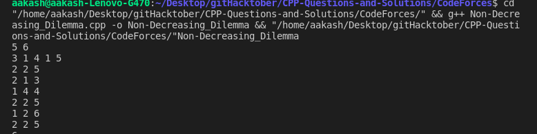
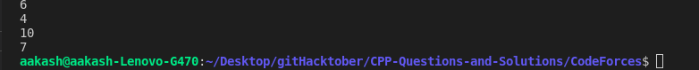

### Issue Id you have worked upon - 
#233

### Briefly explain your program logic - 
This problem is a typical application of segment tree.

We maintain three attributes for each interval:
1. The number of subarray that meet the condition (mark as ans);
2. Starting from the leftmost side, the length of the longest continuous non-decreasing subarray (mark as left_size);
3. Starting from the rightmost, the length of the longest non-decreasing subarray (mark as right_size).

### Screenshots(Attach 2 screenshots of your own input and output) - 

 

### Checklist:
Eg - If your code follow the below guidelines. Kindly change [] to [x]

All the conditions should be fulfilled for considering your code for merging -

[] I have mentioned the question as comment in my solution file. 
[] My code follows the guidelines of this project. 
[] I have performed a self-review of my own code. 
[] I have commented my code. 
[] My code gives the correct output. 
[] I confirm that I have not copied the code from anywhere. In case its found that I have copied I can be banned from the repository. 

[] I affirm that I strictly follow contributing guidelines and code of conduct.
